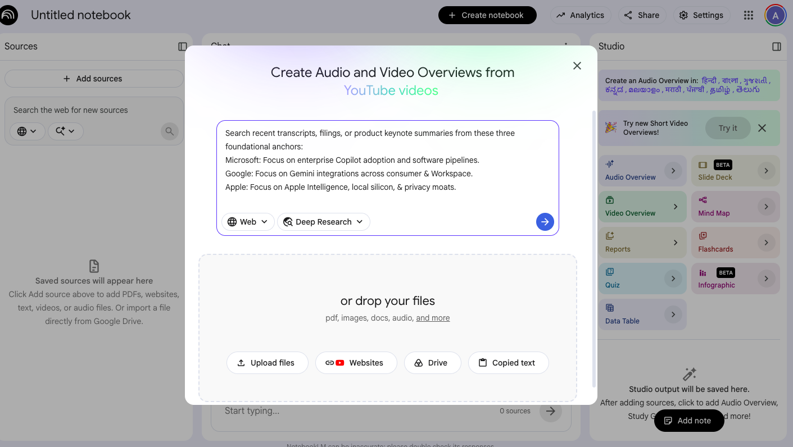
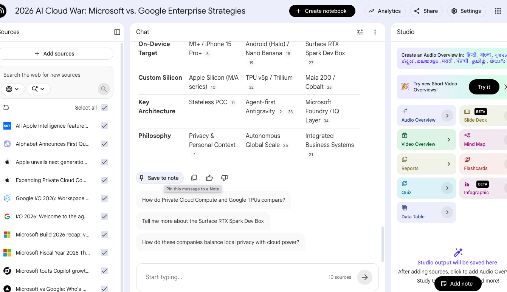
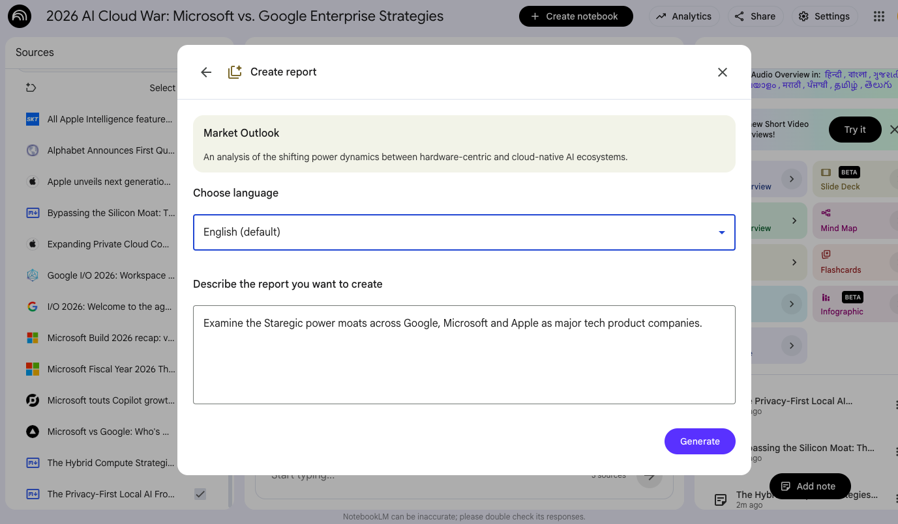
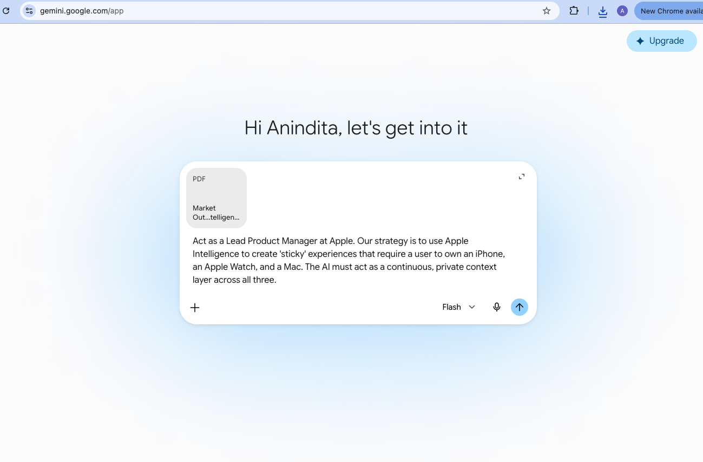
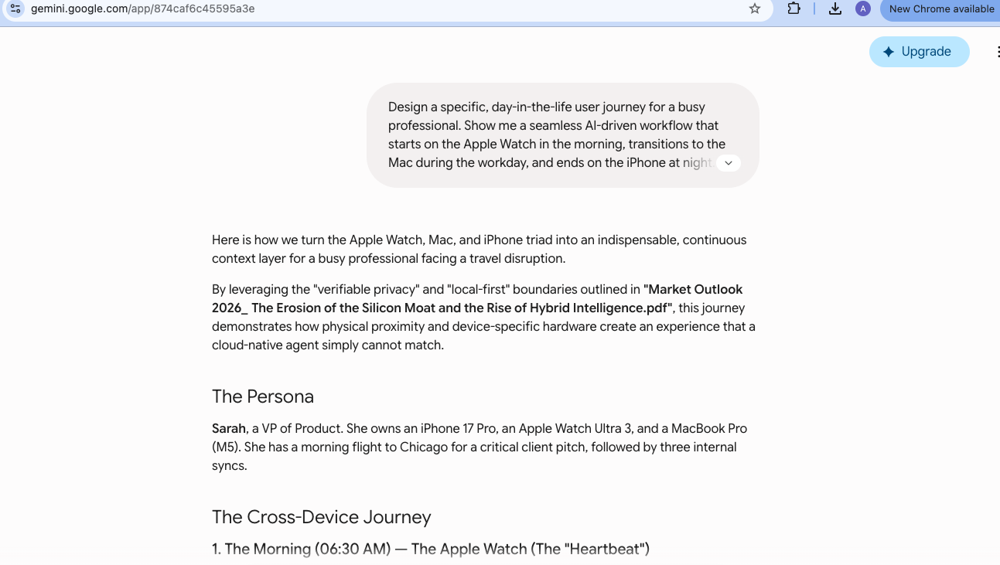
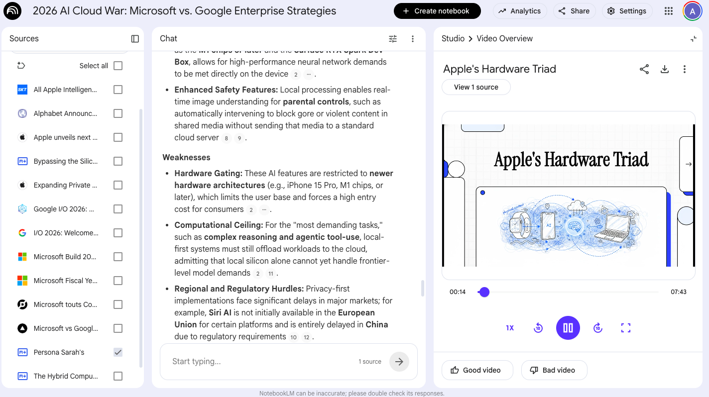

# 🍎 From Zero to Strategy Deck: Using NotebookLM Like a Product Manager

**Audience:** Anyone — no technical background, no prior PM experience required.
**What you'll walk away with:** A real, finished product strategy document (an "Apple Ecosystem Lock-In" strategy) that you built almost entirely by talking to two free AI tools: **NotebookLM** and **Gemini**.

This repo is a step-by-step replay of a real strategy exercise. Every prompt used is copy-paste ready in the [`/prompts`](./prompts) folder, and every AI response we got back is saved in [`/reference-outputs`](./reference-outputs) so you can compare your results as you go. If something looks different for you, that's fine — AI answers vary slightly each time. The goal is to learn the *process*, not to match the output word-for-word.

📸 **Screenshots:** Wherever you see an image placeholder below (`screenshots/step-X.png`), that's a real screenshot from the NotebookLM notebook used to build this — showing exactly what the screen looked like at that step.

---

## 🧠 Before you start: What even is NotebookLM?

[NotebookLM](https://notebooklm.google.com/) is a free Google tool that works like a research assistant with a photographic memory. Here's the only vocabulary you need:

| Term | What it means |
|---|---|
| **Notebook** | A folder-like workspace where you keep everything related to one project (here: "Apple Strategy") |
| **Source** | Any document you feed it — a PDF, a pasted article, a website link. NotebookLM *only* uses what you give it, so its answers stay grounded in real material instead of making things up |
| **Note** | A piece of text you write or generate inside the notebook (like a sticky note). Notes can themselves be turned into sources for later questions — this is the trick this whole exercise is built on |
| **Report** | A longer, structured write-up NotebookLM generates for you from selected sources/notes |

Full glossary with more terms: [`GLOSSARY.md`](./GLOSSARY.md)

---

## 🗺️ The whole workflow at a glance

```
 1. Feed NotebookLM raw research on 3 companies (sources)
          ↓
 2. Ask 3 strategic questions → save each answer as a Note
          ↓
 3. Turn those 3 Notes into sources → generate one Strategic Comparison Report
          ↓
 4. Hand that Report to Gemini with a role-play prompt → get a full strategy blueprint
          ↓
 5. Ask Gemini to turn the blueprint into a "day in the life" story
          ↓
 6. Feed that story back into NotebookLM as a Note/Source → generate a video overview
```

Six steps. Zero code. Let's go.

---

## Step 1 — Load NotebookLM with raw research (the "sources")

**What you're doing:** Giving the AI real, current material so its opinions are grounded in facts instead of guesses.

1. Go to [notebooklm.google.com](https://notebooklm.google.com/) and sign in with any Google account (it's free).
2. Click **New Notebook** and name it something like `Apple Ecosystem Strategy`.
3. Click **Add Source** and upload or paste in 2–3 short recent items — articles, keynote recaps, filings, or Wikipedia sections — covering:
   - **Microsoft** — enterprise Copilot adoption and software pipelines
   - **Google** — Gemini integrations across consumer apps & Workspace
   - **Apple** — Apple Intelligence, on-device chips, and privacy positioning

> 💡 If you don't want to hunt for articles, copy a few paragraphs from each company's Wikipedia "AI strategy" section into a Google Doc and upload that — it's a perfectly valid source.


*(Screenshot placeholder — add yours here)*

- [ ] I have a notebook with at least 3 sources (one per company)

---

## Step 2 — Ask 3 strategic questions and save each answer as a "Note"

This is the step most people skip — and it's the most important one. Instead of asking one big question, you ask three *focused* questions and **save each answer as a Note**. This turns a simple Q&A tool into a strategy-building tool.

Open the copy-paste-ready prompts here: [`prompts/01-market-research-questions.md`](./prompts/01-market-research-questions.md)

For **each** of the 3 prompts:
1. Paste it into NotebookLM's chat box.
2. Read the answer.
3. Click **Save as Note** (or the equivalent "save to notebook" button).
4. Repeat for all 3 prompts — you should end up with 3 separate Notes.


*(Screenshot placeholder — add yours here)*

- [ ] I have 3 saved Notes: Compute Philosophy, Ecosystem Vulnerabilities, and a SWOT Matrix

---

## Step 3 — Turn your Notes into a single Strategic Comparison Report

**What you're doing:** NotebookLM lets you promote a Note into a Source. This means your *own* AI-generated analysis can now be combined with the original research to build something bigger.

1. In your notebook's source list, find the 3 Notes you just created.
2. Select **only** those 3 Notes as active sources (deselect the raw articles for this step).
3. Use NotebookLM's report/summary generation feature and ask it to produce a **Strategic Comparison Report** combining all 3.


*(Screenshot placeholder — add yours here)*

- [ ] I generated one combined Strategic Comparison Report from my 3 Notes

This Report is your evidence base. Everything from here on is opinion and design *built on top of* this evidence — which is exactly how real strategy work is supposed to flow.

---

## Step 4 — Hand the Report to Gemini and ask it to think like a Product Manager

**What you're doing:** Switching tools. NotebookLM is great at grounded research; [Gemini](https://gemini.google.com/) is great at creative, structured thinking. Real strategists move work between tools like this all the time.

1. Copy your Strategic Comparison Report from NotebookLM.
2. Open [Gemini](https://gemini.google.com/) and paste the report in as context.
3. Immediately follow it with this prompt (also saved in [`prompts/02-strategy-analysis-prompt.md`](./prompts/02-strategy-analysis-prompt.md)):

```
Act as a Lead Product Manager at Apple. Our strategy is to use Apple
Intelligence to create 'sticky' experiences that require a user to
own an iPhone, an Apple Watch, and a Mac. The AI must act as a
continuous, private context layer across all three.
```

Compare what you get back to our reference run: [`reference-outputs/01-strategic-blueprint.md`](./reference-outputs/01-strategic-blueprint.md)


*(Screenshot placeholder — add yours here)*

- [ ] I have a full strategy blueprint back from Gemini (it should include product pillars, architecture ideas, and a "why users won't leave" argument)

---

## Step 5 — Turn the strategy into a story a whole team could understand

**What you're doing:** A wall of strategy bullet points doesn't convince anyone. A *story* does. This is how PMs pitch ideas to non-technical stakeholders and executives.

Paste this follow-up into the same Gemini conversation (also in [`prompts/03-day-in-the-life-prompt.md`](./prompts/03-day-in-the-life-prompt.md)):

```
Design a specific, day-in-the-life user journey for a busy
professional. Show me a seamless AI-driven workflow that starts on
the Apple Watch in the morning, transitions to the Mac during the
workday, and ends on the iPhone at night. The workflow should involve
managing an unexpected flight cancellation and rescheduling meetings.
Highlight exactly how the 'On-Device Context' makes this better than
a generic cloud AI.
```

Compare your story to our reference run: [`reference-outputs/02-day-in-the-life-journey.md`](./reference-outputs/02-day-in-the-life-journey.md) — ours follows "Sarah, VP of Product" through a cancelled flight, from Watch → Mac → iPhone.


*(Screenshot placeholder — add yours here)*

- [ ] I have a full narrative walking through morning → workday → evening

---

## Step 6 — Close the loop: turn your story into a video overview

**What you're doing:** Bringing your finished thinking back into NotebookLM, which can turn a Note into a short narrated video/audio overview — a genuinely useful way to share strategy work with people who'd rather watch than read.

1. Copy Gemini's day-in-the-life story.
2. Paste it into your NotebookLM notebook as a new **Note**.
3. Save that Note as a **Source**.
4. Use NotebookLM's **video overview** (or **audio overview**) feature on that source.


*(Screenshot placeholder — add yours here)*

- [ ] I generated a video or audio overview of my finished strategy story

---

## 🏁 What you just proved to yourself

In under an hour, with no coding and no formal PM training, you:
1. Turned scattered raw research into structured evidence
2. Combined AI-generated analysis with real sources (a technique real strategists use constantly)
3. Produced a full strategic blueprint
4. Translated that blueprint into a story non-technical stakeholders could actually follow
5. Packaged it into a shareable video

That entire loop — **research → synthesize → analyze → storytell → package** — is the actual day-to-day work of product strategy. The tools just made it fast.

---

## 📁 What's in this repo

```
notebooklm-pm-strategy-walkthrough/
├── README.md                 ← you are here
├── GLOSSARY.md                ← plain-English definitions of every tool/term used
├── CHECKLIST.md                ← one-page tracker of all 6 steps
├── prompts/                   ← every copy-paste-ready prompt, in order
└── reference-outputs/          ← the actual AI responses from our run-through, for comparison
```

## 🙋 Adding your own screenshots

If you ran through this yourself, replace any file in [`/screenshots`](./screenshots) with your own image (keep the same filename, e.g. `step-1-add-sources.png`) and it'll automatically show up in this README on GitHub.

---

Want to try this same 6-step loop on a different company or product? Swap Step 1's sources for a different set of competitors and re-run the exact same prompts — that's the whole point of a repeatable strategy process.
